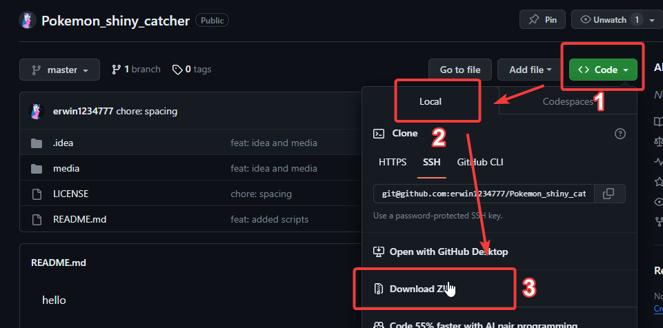
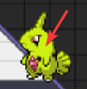
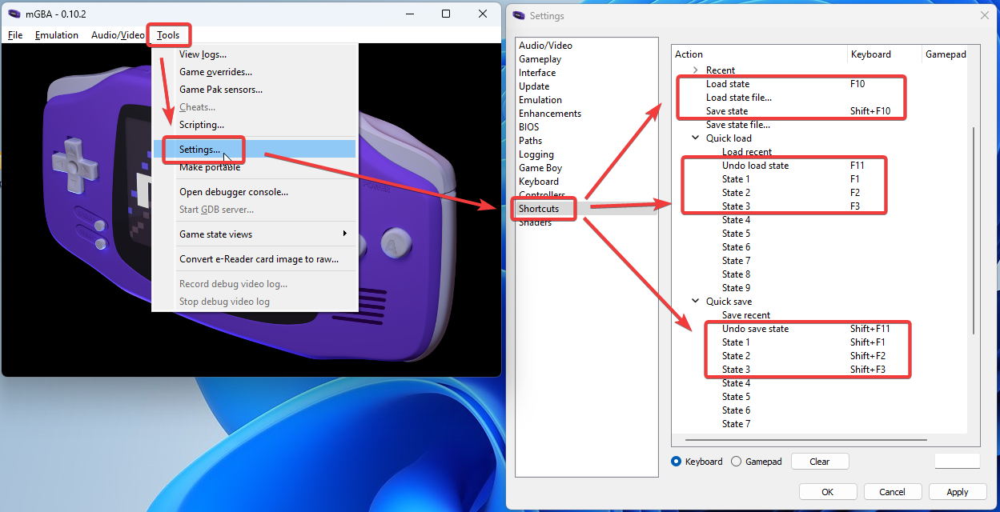
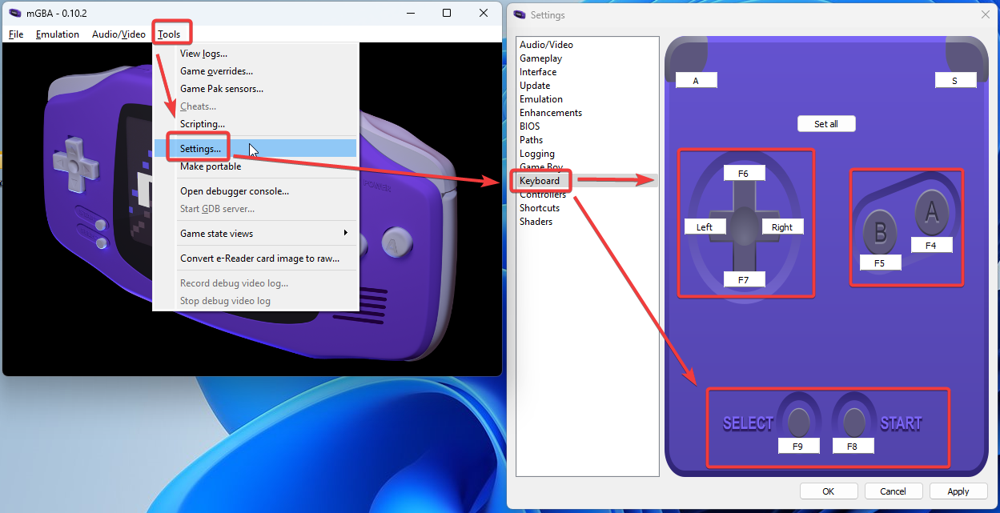

## This is a script used to capture pokémon for the game Pókemon Unbound

### Requirements:
- Ensure you have the official ROM (other roms may work, but please be advised it may not work as intended, you may modify the script to work with other verions under LICENSE included) in the official sources (as of writing this, use their Discord server at [https://discord.com/invite/k34Jm4T](https://discord.com/invite/k34Jm4T))
- Ensure you have version 1 of AHK installed. Version 2 may work but i have not tested, download it from the official website [**HERE**](https://www.autohotkey.com/download/ahk-install.exe)
- Ensure you have an emulator that supports Fast mode(or speed hacks, anything that speeds up the game). This script was used with mGBA, can be found [**HERE**](https://mgba.io/downloads.html)
- Ensure that you have the right keybinds setup. These can be seen within the app by clicking the bottom right `?` icon. See here [**WHY**](#Why-do-i-need-to-remap-my-keybinds?)
- Ensure you download all the contents of this repo onto any location in your computer. Unzip it somewhere

### Features:
- Reset Counter, this shows how many resets happened until you got a shiny. Due to efficiency, it will only update the value when it stops
- Time elapsed, how much time has passed since you started the script
- The color that the script is showing so you can be certain of the color its looking for
- The coordinates that its looking at
- An easy to setup and use UI
- Help buttons all across the app
- Easy Reset and stop buttons
- 3 Different shiny hunting modes, `Static Pokemon`, `Egg Hatch Pokemon` and `Gifted Pokemon`!

### How to use
- First, open the program by going to `LOCATION_YOU_DOWNLOADED_ALL_FILES` and then to the folder called `src`. Run the file called `pokemon_shiny_catch.ahk`. If you downloaded AHK 2.0, it will ask you to download v1, click next and accept, then run the `pokemon_shiny_catch.ahk` file again.
- Open your emulator and run your pokemon unbound game
- Go IN FRONT of the pokemon OR trainer that you want to interact with
- If you set up your keybindings, press Shift + F1 and then Shift + F2 to save the game
- If you are farming for a gift pokemon(aka a pokemon that is GIVEN to you, no battle), SAVE THE GAME, and talk to the person. Once they give you the pokemon, ON THE CHAT, not in your party, click the `Get Color` button. Then move your mouse over the pokemon to an area that you know changes when they are shiny. 

- Move your mouse to that area once the image of the pokemon appears and dont move your mouse for a few seconds(around 10 seconds). Once you click that `Get Color` button, wherever your mouse is at the screen, after 10 seconds it'll get that color and use it to search for a shiny. ENSURE THAT AREA CHANGES when a shiny appears. A good way to do that is to go on the Pokemon Unbound server and searching for `Shiny MY_POKEMON` and see which area of the body changes color.

- Enable fast mode
- Now click `GivenPKMN` and wait. It will stop when it finds a shiny.
- For Static Pokemon, AKA a pokemon that is standing still in front of you, SAVE, then talk to the pokemon. Once you enter battle with it, click `Get Color` and move the mouse to an area of the pokemon that changes color when they are shiny. ENSURE THAT AREA CHANGES when a shiny appears.
- After that, click `StaticPKMN` and wait. It will stop when it finds a shiny.
- 

### Keybinds

`f4` = a

`f5` = b

`f6` = up

`f7` = down

`f8` = start

`f9` = select.

Make sure `F1` and `F2` load state, and that Shift + F1/Shift + F2 save state.

### Why do i need to remap my keybinds?
In short, a lot of apps that i've tried this on block inputs from normal keyboard keys such as `a` `r` `b`, so to avoid that we are using `F*` keys, such as `f1`, `f2`, `f3`, etc to avoid having to work around that issue.

### Why do you have a LICENSE to use this?
The license is there to protect any attempt to use this app to sell pokemon or to catch pokemon for other people in exchange for money, as it prohibits commercial uses. Otherwise, its a very open license.

### I want to change or improve something, how can i do that?
Make a Pull Request on Github https://github.com/erwin1234777/Pokemon_shiny_catcher

### FAQ
- **Q: Why does the app go to the middle of my screen sometimes?**
  - A: This is a way to bypass AHK's lack of color grading and real time changes. To put it in simple terms, i have to destroy and recreate a brand new "app" everytime i need to update a color or image. This happens only when the screen needs an update, its smart in the sense that it'll only do that when necessary, generally after starting the script it'll only happen twice, once when it starts and the second time when it finds a shiny
- **Q: Can i use this for other pokemon games?**
  - A: Absolutely, keep in mind i wont be providing support for it, however feel free to share what you got.
- **Q: Some help icons dont work?**
  - A: Yeah, i havent got the time to update all of them yet.
